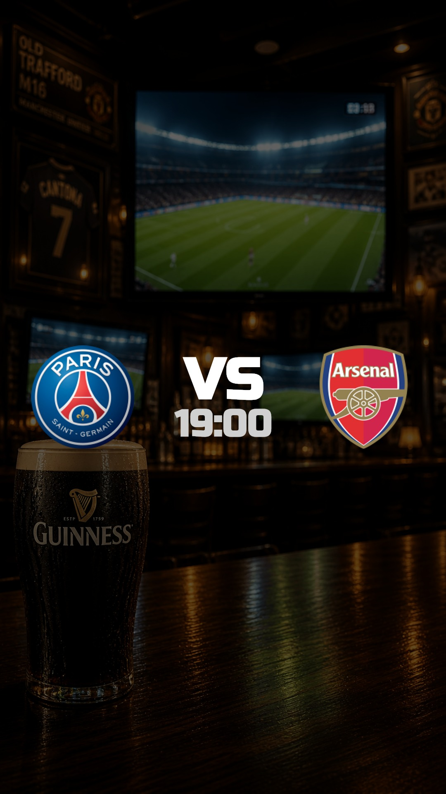
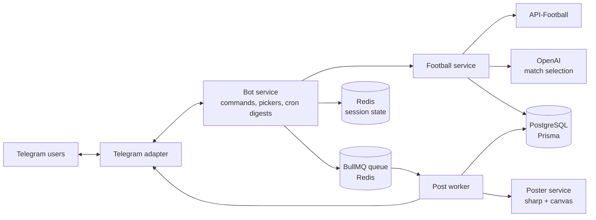

# SassonBot

A Telegram bot that automates match-day promotion for a sports bar. It keeps an up-to-date schedule of football fixtures, selects the matches worth screening each week, and generates ready-to-post promotional posters for them.

The bot is deployed to production and is used by the bar's staff every week.



## What it does

- **Fixture sync.** A weekly cron job pulls fixtures for the bar's favorite leagues from API-Football, filters them by team and round, and stores them in PostgreSQL.
- **Match schedule on demand.** Staff can ask the bot for today's, this week's, or next week's matches, shown in Israel time and grouped by league.
- **Poster generation.** Admins pick matches (or a "headliner" match) and the bot composes a 1080×1920 poster with team logos, kickoff times, a rotating background, and a rotating display font.
- **Weekly album.** Every Friday the bot sends admins the coming week's schedule and builds a full album of posters, one per match day. Matches can be selected in three modes:
  - `ai`: an OpenAI model picks the strongest matches per day, using a strict JSON schema for its response
  - `auto`: a rule-based selection by favorite teams and evening kickoff times
  - `user`: an interactive day-by-day picker built from Telegram inline buttons
- **Role-based access.** Users register with `/start`; an admin code unlocks admin commands, and each user's command menu is set according to their role.

## Tech stack

| Area | Technology |
|---|---|
| Runtime & framework | Node.js, TypeScript, NestJS |
| Database | PostgreSQL with Prisma ORM and migrations |
| Queue & state | Redis, BullMQ, ioredis |
| Messaging | Telegram via Telegraf |
| Image generation | sharp for compositing, @napi-rs/canvas for text rendering |
| AI | OpenAI API with structured outputs |
| Sports data | API-Football (api-sports.io) |
| Testing | Jest, Supertest |
| Deployment | Docker (multi-stage build), Railway |

## Architecture



Some design decisions worth noting:

- **Channel adapter.** Domain logic never talks to Telegram directly. Everything goes through a `ChannelAdapter` interface, with `TelegramAdapter` as its implementation, so another channel (web, WhatsApp) could be added without changing the bot's logic.
- **Asynchronous poster jobs.** Poster generation runs in a BullMQ worker with automatic retries and backoff. If a job fails for good, the requesting admin gets an error message instead of silence.
- **Graceful AI fallback.** If the AI selection fails or no API key is configured, match selection falls back to the rule-based mode, so the weekly album is always produced.
- **Conversation state in Redis.** Multi-step flows (registration, match pickers) keep their state in Redis with TTLs, so stale flows expire on their own.
- **Content rotation.** Backgrounds and fonts are rotated daily and tracked in the database, so consecutive posters don't look the same.

## Project structure

```
src/
├── bot/        Telegram adapter, command handling, match picker, cron digests
├── football/   Fixture sync, match queries, AI and rule-based selection
├── openai/     OpenAI client with a strict JSON-schema response
├── post/       BullMQ queue and worker for poster jobs
├── poster/     Poster composition, background and font rotation
├── prisma/     Database client
├── redis/      Redis client for session state
├── health/     Health check endpoint used by the deployment
└── common/     Channel adapter interface and shared utilities
prisma/         Schema and migrations
scripts/        Local preview scripts for posters, fonts and layouts
test/           End-to-end tests
```

## Running locally

**Requirements:** Node.js 22, Docker

```bash
# 1. Install dependencies
npm install

# 2. Configure environment variables
cp .env.example .env
# then fill in TELEGRAM_BOT_TOKEN, SPORTS_API_KEY, ADMIN_CODE and OPENAI_API_KEY

# 3. Start PostgreSQL and Redis
docker compose up -d

# 4. Apply database migrations
npx prisma migrate dev

# 5. Start the bot in watch mode
npm run start:dev
```

Use a separate Telegram bot token for local development. The bot uses long polling, so two instances sharing a token would compete for updates.

To preview poster layouts without going through Telegram:

```bash
npm run preview:backgrounds
npm run preview:fonts
```

## Bot commands

| Command | Access | Description |
|---|---|---|
| `/start` | Everyone | Register (an admin code grants admin access) |
| `/games_today` | Everyone | Today's matches |
| `/games_week` | Everyone | This week's matches |
| `/games_next_week` | Everyone | Next week's matches |
| `/generate_post` | Admin | Create a poster for selected matches |
| `/generate_album` | Admin | Create the weekly album of posters |
| `/admin_sync_matches` | Admin | Sync fixtures from the sports API now |
| `/admin_load_favorite_leagues` | Admin | Load the configured leagues into the database |

## Testing

```bash
npm run test        # unit tests
npm run test:e2e    # end-to-end tests
npm run test:cov    # coverage report
```

## Deployment

The app is deployed to Railway from a multi-stage Docker build. Each release runs `prisma migrate deploy` before starting, and Railway monitors the `/health` endpoint, which also checks the database connection. PostgreSQL and Redis run as managed services in the same Railway project.
